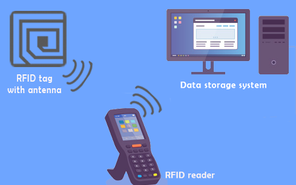
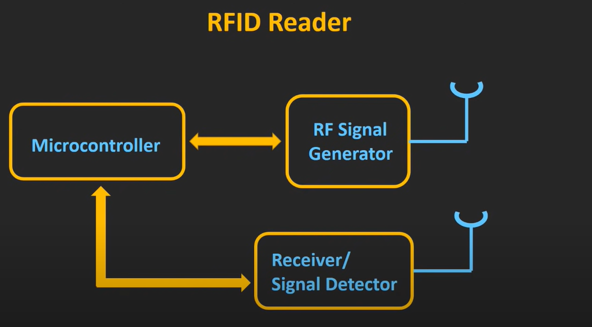
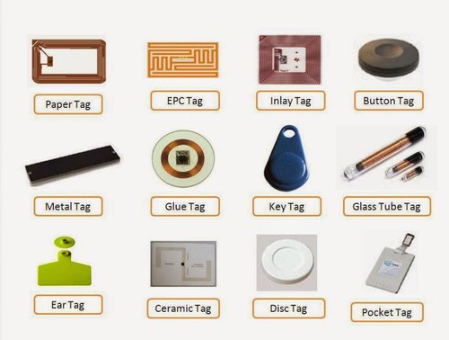
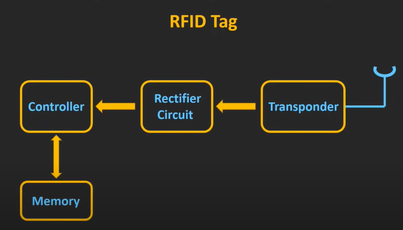

# **RADIO FREQUENCY IDENTIFICATION(RFID)**

## **WHAT IS RFID?**

+ It's working on radio frequency or a radio waves.
+ It's used to automatically indentifying and tracking the objects.
  + It's used to tracking the cars, birds, animals, expencive things, It's also used to identifying books, cloaths in mall, etc.
  
+ Working of RFID is given below:

<!-- (Source: https://www.google.com/url?sa=i&url=https%3A%2F%2Fblog.ezofficeinventory.com%2Frfid-tags%2F&psig=AOvVaw3H1hBIIXvElzfa4V97F6rw&ust=1634578908142000&source=images&cd=vfe&ved=0CAsQjRxqFwoTCKCdj5X_0fMCFQAAAAAdAAAAABAD) -->

> As shown in figure RFID reader will continiously send the radio waves, whenever this RFID tag will be in the range of reader then it will transmit it's feedback signal to the RFID reader.
>> This is simillar tech to the barcode but in that **object** and **scanner** should be in **line of sight** but in RFID is not line of sight techm+nology so it's easy to identtify objects and get their information.

+ using RFID we can track multiple objects at the same time.

## **WHAT IS INSIDE RFID?**

+ **RFID system has two components.**

    1. RFID Reader
        + They are coming inn the large varity.
          + it could be hand helded.
          + it could be size of entry gate which are generally used in malls.
    2. RFID tag
       1. active tag
   
           + they are having their own power supply and while transmitting the feedback signal it will depend of their own power supply.
           + it will have highest range among all types.
       2. passive tag
           + this types of tags will contain power supply.
           + It will relay on radio waves coming from RFID reader for the source of energy.
           + it will have least range among all types.
       3. semi-passive tag
           + they used to have their own powwer supply but transmitting the feedback signal back to the RFID tag they used to relay on signal comming from RFID reader.
           + it will have intermedeat range.
  
### **RFID READER**

<!-- (Source: https://youtu.be/Ukfpq71BoMo) -->

1. RF Signal generator:

    + It will generate radio wave for receiving the feedback signal. the signal information will be comming from the microcontroller and it will be transmitted using antenna.

2. Reciver/ Signal Detector:
  
    + IT will receive the signal from the RFID tag and transmit received signal to the microcontroller.

3. Microcontroller:

    + It will generate the signal configration to be sent and it will process received signal and decode the information from the feedback signal.
    + Sometiles there will be computer insted of tiny microcontroller.

+ In current time, passive tags are used because it will not requires betteries and they are quite compect.

### **RFID TAGS**

<!-- (Source: https://www.indiamart.com/proddetail/rfid-tags-and-inlays-20514658697.html) -->

 As shown in figure there are  verities of RFID tags which can be used in daily life.

1. Transponder:

   + It receives the radio wave received from the reader and sends feedback signal to the reader.

2. Rectifier Circuit:

   + It will get the signal from Treansponder and it will also contain the capacitors which will store energy which will be used to provide feedback to the reader.
   + basically, energy stored in capacitor will be used as supply forcontroller and memory in RFID tag.

3. Controller:

   + It will control the data to be sent to the reader from mthe memory and process the received signal.

4. Memory:

   + Memory will contain the information which is to sent when RFID tag will receive the data request signal.

### **Frequency of Operation in RFID System:**

    + LF(Low Frequency)
        + 125 kHz or 134 kHz
        + Range: upto 10 cm
  
    + HF(High Frequency)
        + 13.56 MHz
        + Range: upto 1 m 

    + UHF(Ultra High Frequency)
        + 860-960 MHz
        + Range: 10-15 m

+ This frequency range will vary from mcountry to country but majority of countries used to follow this frequencies.

### **Working Pronciple**

+ LF and HF RFIDs

    + This types of RFIDs are generally uses Inductive coupling(Near Field Coupling).
