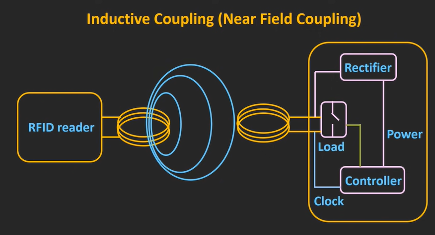
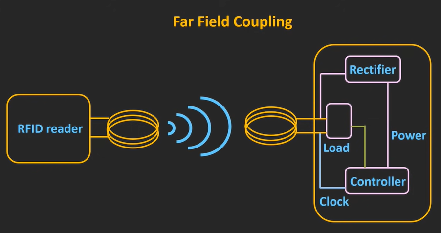
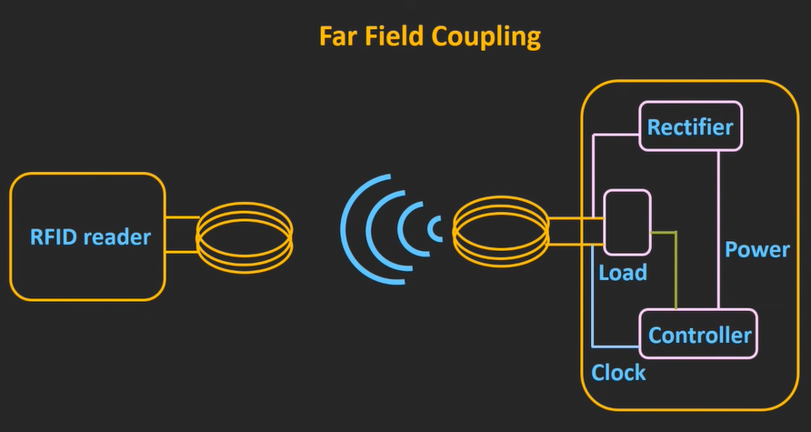

# **RADIO FREQUENCY IDENTIFICATION(RFID)**

## **WHAT IS RFID?**

+ It's working on radio frequency or a radio waves.
+ It's used to automatically indentifying and tracking the objects.
  + It's used to tracking the cars, birds, animals, expencive things, It's also used to identifying books, cloaths in mall, etc.
  
+ Working of RFID is given below:

<!-- (Source: https://www.google.com/url?sa=i&url=https%3A%2F%2Fblog.ezofficeinventory.com%2Frfid-tags%2F&psig=AOvVaw3H1hBIIXvElzfa4V97F6rw&ust=1634578908142000&source=images&cd=vfe&ved=0CAsQjRxqFwoTCKCdj5X_0fMCFQAAAAAdAAAAABAD) -->

> As shown in figure RFID reader will continiously send the radio waves, whenever this RFID tag will be in the range of reader then it will transmit it's feedback signal to the RFID reader.
>> This is simillar tech to the barcode but in that **object** and **scanner** should be in **line of sight** but in RFID is not line of sight techm+nology so it's easy to identtify objects and get their information.

+ using RFID we can track multiple objects at the same time.

## **WHAT IS INSIDE RFID?**

+ **RFID system has two components.**

    1. RFID Reader
        + They are coming inn the large varity.
          + it could be hand helded.
          + it could be size of entry gate which are generally used in malls.
    2. RFID tag
       1. active tag
   
           + they are having their own power supply and while transmitting the feedback signal it will depend of their own power supply.
           + it will have highest range among all types.
       2. passive tag
           + this types of tags will contain power supply.
           + It will relay on radio waves coming from RFID reader for the source of energy.
           + it will have least range among all types.
       3. semi-passive tag
           + they used to have their own powwer supply but transmitting the feedback signal back to the RFID tag they used to relay on signal comming from RFID reader.
           + it will have intermedeat range.
  
### **RFID READER**

<!-- (Source: https://youtu.be/Ukfpq71BoMo) -->

1. RF Signal generator:

    + It will generate radio wave for receiving the feedback signal. the signal information will be comming from the microcontroller and it will be transmitted using antenna.

2. Reciver/ Signal Detector:
  
    + IT will receive the signal from the RFID tag and transmit received signal to the microcontroller.

3. Microcontroller:

    + It will generate the signal configration to be sent and it will process received signal and decode the information from the feedback signal.
    + Sometiles there will be computer insted of tiny microcontroller.

+ In current time, passive tags are used because it will not requires betteries and they are quite compect.

### **RFID TAGS**

<!-- (Source: https://www.indiamart.com/proddetail/rfid-tags-and-inlays-20514658697.html) -->

 As shown in figure there are  verities of RFID tags which can be used in daily life.

1. Transponder:

   + It receives the radio wave received from the reader and sends feedback signal to the reader.

2. Rectifier Circuit:

   + It will get the signal from Treansponder and it will also contain the capacitors which will store energy which will be used to provide feedback to the reader.
   + basically, energy stored in capacitor will be used as supply forcontroller and memory in RFID tag.

3. Controller:

   + It will control the data to be sent to the reader from mthe memory and process the received signal.

4. Memory:

   + Memory will contain the information which is to sent when RFID tag will receive the data request signal.

### **Frequency of Operation in RFID System:**

+ LF(Low Frequency)
   + 125 kHz or 134 kHz
   + Range: upto 10 cm

+ HF(High Frequency)
   + 13.56 MHz
   + Range: upto 1 m 

+ UHF(Ultra High Frequency)
   + 860-960 MHz
   + Range: 10-15 m

+ This frequency range will vary from country to country but majority of countries used to follow this frequencies.

### **Working Pronciple**

+ **LF and HF RFIDs**

    + This types of RFIDs are generally uses Inductive coupling(Near Field Coupling).
    + RFID reader will contineusly send the radio wave with perticular(rated) frequency. It will serve three porposes:
        1. Induce enough power into Tag
        2. Synchronization clock to Tag
        3. Act as a carrier for return data from tag

<!-- (Source: https://youtu.be/Ukfpq71BoMo) -->

+ As shown in figure both reader and tag are close to eachother so the working principle will be based on inductive coupling.
+ Field generated by the reader will be coupled to the RFID tag and because of mutual coupling voltagge will be induce in coil of RFID tag.
    + Some portion of the induced emf will be rectified and used as power supply for controller and memory element.
    + RFID reader is sending a radio waves of a perticular frequency so voltage that is induced will also of perticular frequency. so this voltage will also used to derive the synchronisation clock for the microcontroller.
+ If we connect load( shown in figure) across the coil then current will start to flow. If we change the impedance of the load then current will also change.
    + If we switch on and off the load then current will also switch on and off.
    + This switching on and off of the current will generate the emf at RFID reader. 
    + THis switching of the load is known as ***load modulation***.
    + **If we switch load on the basis of our data then that data can be read by the RFID reader inform of voltage.**
    + In this way we are generating modualtion on a carrier frequency.

+ **UHF RFIDs(Far Field Coupling)**

    + This type of RFIDs uses Electromegnetic coupling.
    + distance between reader and tag will be more far so that far field coupling is been used.

<!-- (Source: same as before) -->

+ RFID reader as shown in upper figure will continously send the electromegnetic signal towards the RFID tag.   

+ As a responce RFID tag will send the weak signal(electromegnetic) to the RFID reacder as shown in upper figure.
+ weak signal is known as **backscattered signal** and it's intencity of this signal will depend upon load matching of the coil.
    + If load matches in a maximum extent then there will be more intencity of received signal.
+ If we change the condition of load(It's also in the figure) according to the data which is stored in RFID tag then we can send that data to the reader.

> Initial signal which is to be send by the reader should be strong so that tag will send back signal that can be retrived.

+ It ls known as **"Backscatter Modulaion"** modulation technique.

## **Applications**

+ Institutions
    1. Library
    2. Hospital
    3. School
    4. Colleges
+ Transport and Logistics
+ Access Control
+ Sports
+ Animal Tracking